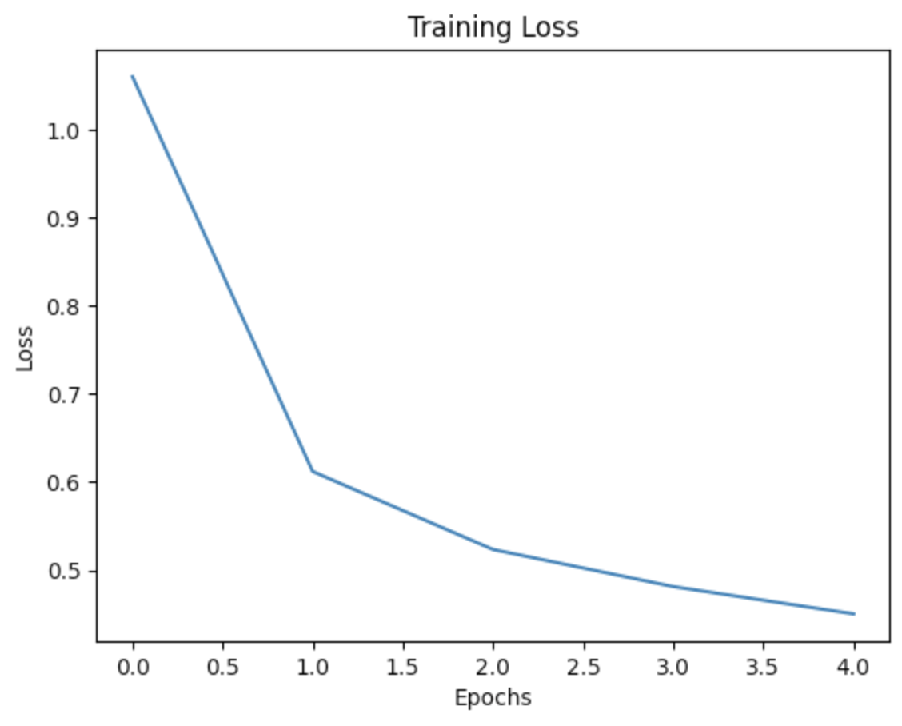
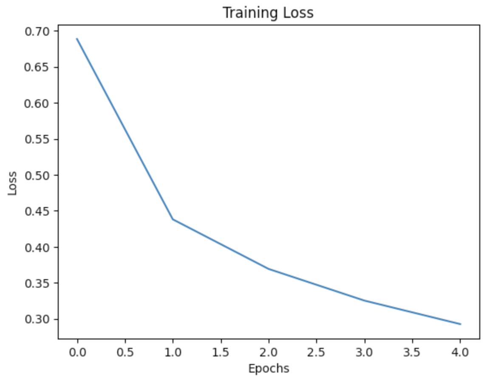

# Fashion-MNIST: Neural Network vs Convolutional Neural Network

## Overview

This project compares the performance of a fully connected Neural Network (NN) and a Convolutional Neural Network (CNN) on the Fashion-MNIST dataset.

The objective was to investigate how a CNN's ability to learn spatial features from images compares to a traditional feedforward neural network when trained under similar conditions.

---

## Dataset

Fashion-MNIST is a dataset of grayscale clothing images consisting of:

* 60,000 training images
* 10,000 test images
* Image size: 28 × 28 pixels
* 10 clothing categories

Examples include:

* T-shirt/top
* Trouser
* Pullover
* Dress
* Coat
* Sandal
* Shirt
* Sneaker
* Bag
* Ankle boot

---

## Experiment Setup

Both models were trained using:

| Parameter     | Value            |
| ------------- | ---------------- |
| Epochs        | 5                |
| Batch Size    | 64               |
| Optimizer     | Adam             |
| Learning Rate | 0.0001           |
| Loss Function | CrossEntropyLoss |

---

## Neural Network (NN)

### Architecture

```python
Linear(784, 372)
ReLU()

Linear(372, 180)
ReLU()

Linear(180, 90)
ReLU()

Linear(90, 45)
ReLU()

Linear(45, 22)
ReLU()

Linear(22, 10)
```

### Input Processing

Images were flattened from:

```text
28 × 28 → 784
```

Normalization:

```python
X = X / 255.0
```

### Test Accuracy

**84.23%**

---

## Convolutional Neural Network (CNN)

### Architecture

```python
Conv2d(1, 32, kernel_size=3)
ReLU()

Conv2d(32, 64, kernel_size=3)
ReLU()

MaxPool2d(2,2)

Conv2d(64, 128, kernel_size=3)
ReLU()

MaxPool2d(2,2)

Flatten()

Linear(128*5*5, 1000)
ReLU()

Linear(1000, 250)
ReLU()

Linear(250, 100)
ReLU()

Linear(100, 10)
```

### Input Processing

Images retained their spatial structure:

```text
1 × 28 × 28
```

Normalization:

```python
(X / 255.0 - 0.5) / 0.5
```

### Test Accuracy

**89.67%**

---

## Results

| Model          | Test Accuracy |
| -------------- | ------------- |
| Neural Network | 84.23%        |
| CNN            | 89.67%        |

### Accuracy Improvement

```text
89.67 - 84.23 = 5.44%
```

The CNN achieved a **5.44 percentage point improvement** over the fully connected neural network.

---

## Training Loss

### Neural Network Loss Curve



### CNN Loss Curve



---

## Discussion

The fully connected neural network treats every pixel independently after flattening the image into a 784-dimensional vector. As a result, spatial relationships between neighboring pixels are lost.

The CNN, however, preserves the 2D image structure and learns local patterns such as:

* Edges
* Corners
* Textures
* Clothing shapes

By using convolutional filters and pooling operations, the CNN can extract more meaningful visual features, leading to better generalization on unseen images.

This experiment demonstrates why CNNs are generally preferred over standard feedforward neural networks for image classification tasks.

---

## Conclusion

Under similar training conditions:

* Same dataset
* Same optimizer
* Same learning rate
* Same batch size
* Same number of epochs

The Convolutional Neural Network significantly outperformed the fully connected Neural Network.

| Model          | Accuracy |
| -------------- | -------- |
| Neural Network | 84.23%   |
| CNN            | 89.67%   |

The results confirm the advantage of convolutional architectures for image-based machine learning tasks, as they can learn spatial features directly from image data.
